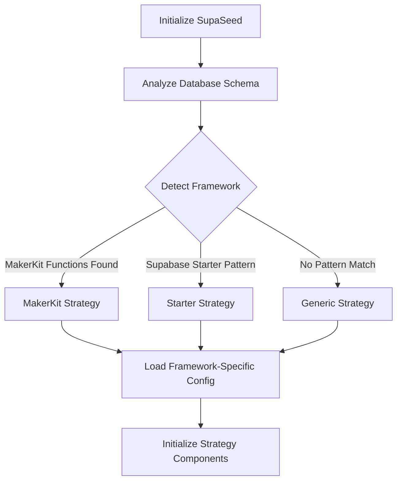
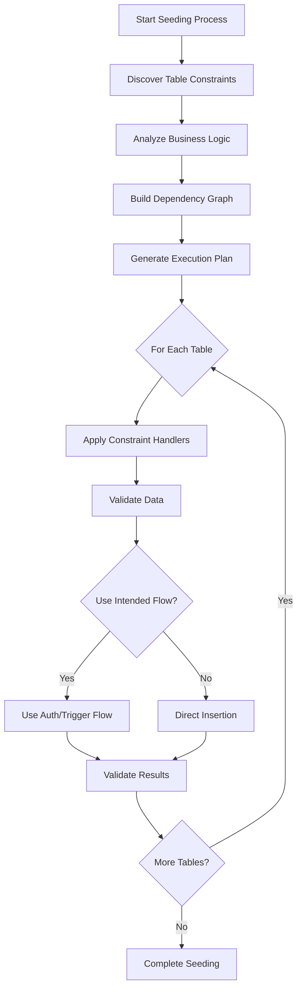
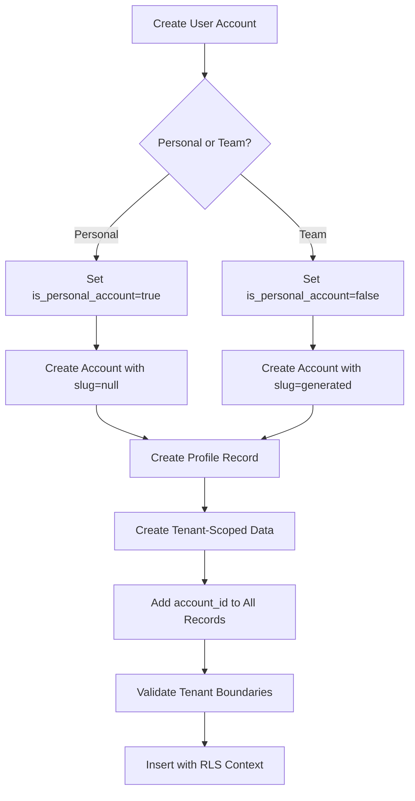

# Product Requirements Document (PRD)
## SupaSeed v2.4.0 - Framework-Aware Architecture Overhaul

### Executive Summary

The current SupaSeed v2.3.2 treats all Supabase databases as generic schemas, but **opinionated frameworks like MakerKit require framework-aware seeding strategies**. This PRD outlines the architectural transformation needed to make SupaSeed universally compatible with any opinionated Supabase framework while maintaining extensibility for custom schemas.

### Problem Statement

**Core Issue**: SupaSeed fails with constraint violations because it bypasses framework business logic (triggers, RLS policies, intended data flows) and attempts direct database insertion instead of respecting framework patterns.

**Current Failure Pattern**:
- v2.2.0: "Profiles can only be created for personal accounts" 
- v2.3.2: "accounts_slug_null_if_personal_account_true" constraint violation

---

## Feature Requirements Breakdown

### 1. Framework Strategy Pattern System
**Epic**: Core Architecture Transformation
**Priority**: P0 (Critical)

#### Requirements:
- **FR-1.1**: Implement pluggable framework detection system
- **FR-1.2**: Create strategy pattern for framework-specific seeding logic
- **FR-1.3**: Support MakerKit v2, MakerKit v3, and generic strategies
- **FR-1.4**: Provide framework override configuration options
- **FR-1.5**: Fallback to generic strategy when detection fails

#### Acceptance Criteria:
- ✅ Automatically detects MakerKit via `kit.setup_new_user()` function presence
- ✅ Uses appropriate user creation flow for detected framework
- ✅ Provides clear framework detection in verbose output
- ✅ Allows manual framework override in configuration

### 2. Dynamic Constraint Discovery Engine
**Epic**: Constraint-Aware Intelligence
**Priority**: P0 (Critical)

#### Requirements:
- **FR-2.1**: Query PostgreSQL system tables for constraint discovery
- **FR-2.2**: Generate constraint handlers automatically
- **FR-2.3**: Handle check constraints, foreign key constraints, and unique constraints
- **FR-2.4**: Provide constraint violation debugging information
- **FR-2.5**: Cache constraint analysis with schema version detection

#### Acceptance Criteria:
- ✅ Discovers constraints via `information_schema` queries
- ✅ Automatically handles `accounts_slug_null_if_personal_account_true` constraint
- ✅ Provides >80% constraint discovery confidence in typical schemas
- ✅ Generates actionable constraint violation error messages

### 3. Business Logic Respect System
**Epic**: Framework Integration
**Priority**: P0 (Critical)

#### Requirements:
- **FR-3.1**: Analyze database triggers before direct table insertion
- **FR-3.2**: Use intended data flows (auth.users → trigger → accounts/profiles)
- **FR-3.3**: Respect RLS policies during seeding process
- **FR-3.4**: Provide business logic bypass options for advanced users
- **FR-3.5**: Handle trigger-based account creation for MakerKit

#### Acceptance Criteria:
- ✅ MakerKit user creation works via `auth.admin.createUser()` + triggers
- ✅ No RLS policy bypass required for realistic test data
- ✅ Maintains business logic compliance throughout seeding
- ✅ Provides fallback when triggers are unavailable

### 4. Relationship-Aware Seeding Engine
**Epic**: Complex Data Modeling
**Priority**: P1 (High)

#### Requirements:
- **FR-4.1**: Query foreign key relationships to build dependency graphs
- **FR-4.2**: Seed tables in correct dependency order
- **FR-4.3**: Handle junction tables and many-to-many relationships
- **FR-4.4**: Maintain referential integrity throughout seeding process
- **FR-4.5**: Support circular dependency resolution

#### Acceptance Criteria:
- ✅ Automatically determines seeding order: users → accounts → setups → gear → media
- ✅ Handles complex relationships (setups ↔ gear ↔ users ↔ media)
- ✅ Maintains referential integrity with proper foreign key values
- ✅ Resolves circular dependencies gracefully

### 5. Multi-Tenant Architecture Support
**Epic**: Enterprise Security
**Priority**: P1 (High)

#### Requirements:
- **FR-5.1**: Automatically add `account_id` to tenant-scoped tables
- **FR-5.2**: Validate tenant isolation during seeding
- **FR-5.3**: Support both personal and team account scenarios
- **FR-5.4**: Respect MakerKit's security boundaries
- **FR-5.5**: Provide tenant-aware data generation

#### Acceptance Criteria:
- ✅ All seeded data respects tenant boundaries with proper `account_id` foreign keys
- ✅ No cross-tenant data contamination
- ✅ Supports both personal accounts (`is_personal_account=true`) and team accounts
- ✅ Validates tenant isolation before and after seeding

### 6. Storage Integration System
**Epic**: File Management
**Priority**: P2 (Medium)

#### Requirements:
- **FR-6.1**: Support Supabase Storage bucket file uploads
- **FR-6.2**: Generate realistic images using external APIs with domain search
- **FR-6.3**: Create proper database records linking to storage files
- **FR-6.4**: Respect storage RLS policies and bucket permissions
- **FR-6.5**: Handle multiple file types and storage patterns

#### Acceptance Criteria:
- ✅ Uploads realistic images to correct storage buckets
- ✅ Creates media_attachments records linking to storage files
- ✅ Respects storage RLS policies without bypass
- ✅ Generates domain-appropriate images (outdoor-adventure for Wildernest)

### 7. Configuration Extensibility Framework
**Epic**: Developer Experience
**Priority**: P2 (Medium)

#### Requirements:
- **FR-7.1**: Allow framework strategy overrides
- **FR-7.2**: Support custom constraint handlers
- **FR-7.3**: Enable schema evolution detection
- **FR-7.4**: Provide realistic data volume configuration options
- **FR-7.5**: Support custom table relationship definitions

#### Acceptance Criteria:
- ✅ Developers can override framework detection with custom strategies
- ✅ Custom constraint handlers can be defined via configuration
- ✅ Schema changes are detected and handled gracefully
- ✅ Data volumes are configurable and realistic for testing needs

### 8. Realistic Data Generation Engine
**Epic**: Test Data Quality
**Priority**: P2 (Medium)

#### Requirements:
- **FR-8.1**: Generate realistic data volumes matching real-world usage patterns
- **FR-8.2**: Create appropriate public/private content ratios
- **FR-8.3**: Support domain-specific data generation (outdoor gear, SaaS tools, etc.)
- **FR-8.4**: Maintain data consistency across related tables
- **FR-8.5**: Provide rich content for comprehensive testing

#### Acceptance Criteria:
- ✅ Generates minimum 4 users for testing different scenarios
- ✅ Creates 2 setups per user with 5 related items each
- ✅ Maintains 75% public / 25% private content ratio
- ✅ Produces rich, interconnected data suitable for discovery testing

---

## Design Specifications

### System Architecture

#### 1. Core Framework Strategy Pattern
```typescript
interface SeedingStrategy {
  name: string;
  detect(schema: DatabaseSchema): Promise<FrameworkDetectionResult>;
  createUser(data: UserData): Promise<User>;
  handleConstraints(table: string, data: any): Promise<any>;
  getRecommendations(): string[];
  supportsFeature(feature: string): boolean;
}

class SupaSeed {
  private strategies: SeedingStrategy[] = [
    new MakerKitV2Strategy(),
    new MakerKitV3Strategy(),
    new SupabaseStarterStrategy(),
    new GenericStrategy() // fallback
  ];

  async initialize(client: SupabaseClient): Promise<void> {
    this.strategy = await this.detectStrategy(client);
    this.constraintEngine = new ConstraintDiscoveryEngine(client);
    this.relationshipAnalyzer = new RelationshipAnalyzer(client);
  }
}
```

#### 2. Constraint Discovery Engine
```typescript
class ConstraintDiscoveryEngine {
  async discoverConstraints(tableName: string): Promise<TableConstraints> {
    const checkConstraints = await this.queryCheckConstraints(tableName);
    const foreignKeys = await this.queryForeignKeyConstraints(tableName);
    const uniqueConstraints = await this.queryUniqueConstraints(tableName);
    
    return {
      table: tableName,
      checkConstraints: checkConstraints.map(this.generateConstraintHandler),
      foreignKeys: foreignKeys.map(this.generateForeignKeyHandler),
      uniqueConstraints: uniqueConstraints.map(this.generateUniqueHandler)
    };
  }

  private async queryCheckConstraints(tableName: string): Promise<CheckConstraint[]> {
    const { data } = await this.client.rpc('get_check_constraints', {
      table_name: tableName
    });
    return data;
  }
}
```

#### 3. Business Logic Analyzer
```typescript
class BusinessLogicAnalyzer {
  async analyzeTriggers(tableName: string): Promise<TriggerAnalysis> {
    const triggers = await this.getTriggers(tableName);
    const functions = await this.getRelatedFunctions(triggers);
    
    return {
      hasInsertTriggers: triggers.some(t => t.event === 'INSERT'),
      intentedFlow: this.determineIntendedFlow(triggers, functions),
      recommendedApproach: this.getRecommendedApproach(triggers)
    };
  }

  private determineIntendedFlow(triggers: Trigger[], functions: Function[]): DataFlow {
    // Analyze trigger patterns to determine intended data creation flow
    // For MakerKit: auth.users → kit.setup_new_user() → accounts + profiles
    if (functions.some(f => f.name === 'kit.setup_new_user')) {
      return {
        type: 'auth_trigger_based',
        entry_point: 'auth.users',
        creates_tables: ['accounts', 'profiles'],
        strategy: 'use_auth_admin_create_user'
      };
    }
    
    return { type: 'direct_insertion', strategy: 'insert_with_constraints' };
  }
}
```

#### 4. Multi-Tenant Data Manager
```typescript
class MultiTenantDataManager {
  async createTenantScopedData(
    accountId: string, 
    tableConfig: TableConfig, 
    data: any[]
  ): Promise<any[]> {
    // Automatically add account_id to tenant-scoped data
    const tenantData = data.map(item => ({
      ...item,
      account_id: accountId,
      created_at: new Date().toISOString(),
      updated_at: new Date().toISOString()
    }));

    // Validate tenant boundaries
    await this.validateTenantIsolation(tableConfig.name, tenantData);
    
    // Insert with proper RLS context
    return await this.insertWithRLSContext(tableConfig.name, tenantData);
  }

  private async validateTenantIsolation(
    tableName: string, 
    data: any[]
  ): Promise<void> {
    // Ensure all records have proper account_id
    // Validate against tenant scope configuration
    // Check for cross-tenant references
  }
}
```

#### 5. Storage Integration Manager
```typescript
class StorageIntegrationManager {
  async seedWithStorageFiles(
    setupId: string, 
    config: StorageConfig
  ): Promise<MediaAttachment[]> {
    const images = await this.generateDomainImages({
      domain: config.domain || 'general',
      categories: config.categories || ['general'],
      count: config.imagesPerSetup || 3
    });

    const attachments: MediaAttachment[] = [];
    
    for (const image of images) {
      // Upload to storage bucket
      const path = `${setupId}/${image.filename}`;
      const { error } = await this.client.storage
        .from(config.bucketName)
        .upload(path, image.blob);

      if (!error) {
        // Create database record
        const attachment = await this.createMediaAttachment({
          setup_id: setupId,
          file_path: path,
          file_type: image.type,
          file_size: image.size,
          alt_text: image.description
        });
        
        attachments.push(attachment);
      }
    }

    return attachments;
  }
}
```

### Data Flow Architecture

#### 1. Framework Detection Flow


#### 2. Constraint-Aware Seeding Flow


#### 3. Multi-Tenant Data Creation Flow


### Configuration Schema

#### 1. Framework Configuration
```json
{
  "framework": {
    "detection": "auto",
    "override": null,
    "strategies": {
      "makerkit-v2": {
        "userCreationFlow": "auth-trigger",
        "constraintHandling": "auto-adapt",
        "businessLogicRespect": true,
        "tenantBoundaries": true
      },
      "generic": {
        "userCreationFlow": "direct-insertion",
        "constraintHandling": "discovery-based",
        "businessLogicRespect": false,
        "tenantBoundaries": false
      }
    }
  }
}
```

#### 2. Constraint Configuration
```json
{
  "constraints": {
    "enableDiscovery": true,
    "enableAutoHandling": true,
    "customHandlers": {
      "accounts": {
        "accounts_slug_null_if_personal_account_true": {
          "handler": "set_slug_null_for_personal_accounts",
          "priority": "high"
        }
      }
    },
    "fallbackStrategies": ["skip_constraint", "use_defaults", "manual_fix"]
  }
}
```

#### 3. Data Generation Configuration
```json
{
  "dataGeneration": {
    "volumes": {
      "users": 4,
      "setupsPerUser": 2,
      "gearPerSetup": 5,
      "imagesPerSetup": 3
    },
    "ratios": {
      "publicContent": 0.75,
      "privateContent": 0.25
    },
    "domains": {
      "primary": "outdoor-adventure",
      "categories": ["camping", "hiking", "climbing"],
      "imageSearch": "unsplash"
    }
  }
}
```

### Success Metrics

#### Technical Metrics
- **Constraint Discovery Accuracy**: >90% of constraints discovered automatically
- **Framework Detection Confidence**: >95% for supported frameworks
- **Seeding Success Rate**: >99% for detected frameworks
- **Data Integrity**: 100% referential integrity maintained
- **Performance**: <30 seconds for full seeding of 4 users with related data

#### Business Metrics
- **Framework Compatibility**: Support for 3+ major Supabase frameworks
- **Developer Experience**: <5 minutes from install to working test data
- **Issue Reduction**: 80% reduction in framework-specific bug reports
- **Community Adoption**: Framework-specific documentation and examples

This PRD provides the foundation for transforming SupaSeed from a generic schema tool into a framework-aware, constraint-intelligent seeding platform that works seamlessly with any opinionated Supabase framework.