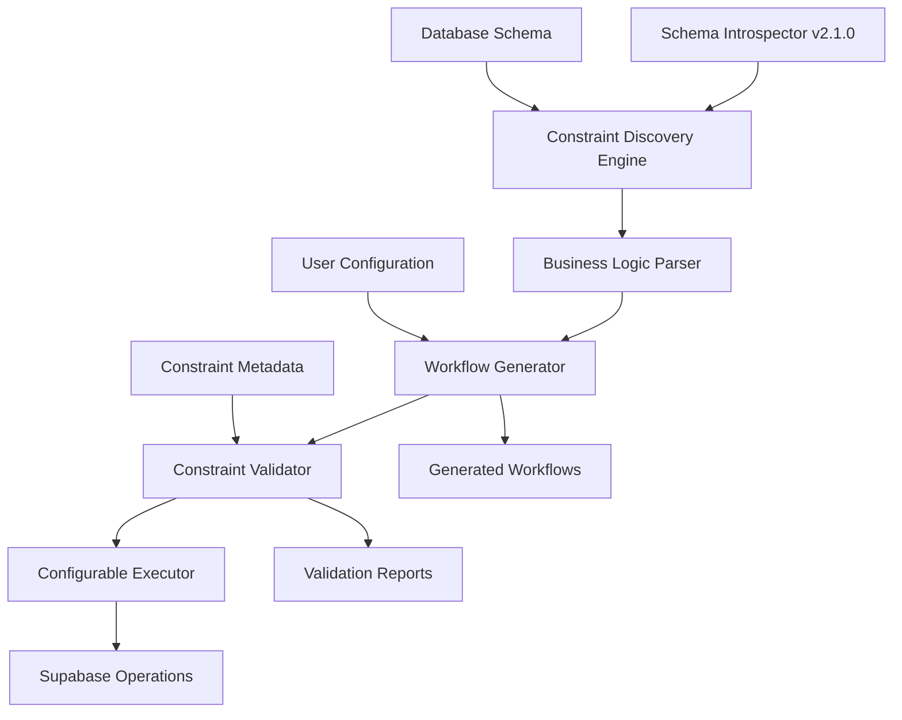

# Supa-Seed v2.2.0: Constraint-Aware Architecture Plan

**Document Type**: Technical Design Specification  
**Target Version**: v2.2.0  
**Date**: 2025-07-25  
**Status**: Design Phase  
**Priority**: High - Core architectural evolution  

## 🎯 Executive Summary

This document outlines the architectural plan to evolve supa-seed from "schema-first" (v2.1.0) to "constraint-aware" (v2.2.0), enabling full configurability of business logic workflows and eliminating hardcoded assumptions about database operations.

## 📋 Requirements Analysis

### **Functional Requirements**

#### **FR-1: Constraint Discovery System**
- **Requirement**: Automatically discover and parse PostgreSQL constraints, triggers, and functions
- **Priority**: P0 (Critical)
- **Acceptance Criteria**:
  - Parse trigger definitions to extract business logic
  - Identify constraint functions and their validation rules
  - Map dependencies between tables based on constraints
  - Generate constraint metadata with confidence scoring

#### **FR-2: Configurable Workflow Engine**
- **Requirement**: Support fully configurable user creation workflows
- **Priority**: P0 (Critical) 
- **Acceptance Criteria**:
  - JSON-based workflow definitions
  - Conditional step execution based on constraints
  - Dynamic field population with constraint awareness
  - Workflow validation before execution

#### **FR-3: Business Logic Validation**
- **Requirement**: Pre-validate operations against discovered constraints
- **Priority**: P0 (Critical)
- **Acceptance Criteria**:
  - Pre-execution constraint validation
  - Graceful handling of constraint violations
  - Auto-suggestion of constraint fixes
  - Detailed validation error reporting

#### **FR-4: Conditional Table Operations**
- **Requirement**: Support conditional creation/skipping of table operations
- **Priority**: P1 (High)
- **Acceptance Criteria**:
  - Skip operations that would violate constraints
  - Conditional field population based on dependencies
  - Support for optional vs required table operations
  - Rollback capability for failed constraint validations

#### **FR-5: Framework-Agnostic Configuration**
- **Requirement**: Work with any PostgreSQL schema without hardcoded assumptions
- **Priority**: P1 (High)
- **Acceptance Criteria**:
  - No hardcoded table names or relationships
  - Discovery-based operation planning
  - Custom business logic rule support
  - Multi-framework compatibility (MakerKit v1/v2/v3, custom schemas)

### **Non-Functional Requirements**

#### **NFR-1: Performance**
- Constraint discovery should complete within 5 seconds for typical schemas
- Workflow validation should add <100ms overhead per operation
- Memory usage should not exceed 100MB for constraint metadata

#### **NFR-2: Reliability**
- 99.9% success rate for constraint discovery on valid PostgreSQL schemas
- Graceful degradation when constraints cannot be parsed
- Comprehensive error handling with actionable guidance

#### **NFR-3: Usability**
- Zero-configuration operation for standard MakerKit setups
- Clear configuration syntax for custom workflows
- Detailed validation feedback with suggested fixes

#### **NFR-4: Maintainability**
- Modular architecture with clear separation of concerns
- Comprehensive test coverage (>90%) for constraint parsing
- Documentation with examples for common patterns

## 🏗️ Architecture Design

### **System Overview**



### **Core Components**

#### **1. Constraint Discovery Engine**
```typescript
interface ConstraintDiscoveryEngine {
  discoverConstraints(schema: DatabaseSchema): Promise<ConstraintMetadata>;
  parseConstraintFunctions(functions: PostgreSQLFunction[]): BusinessRule[];
  analyzeTriggers(triggers: PostgreSQLTrigger[]): TriggerRule[];
  buildDependencyGraph(constraints: ConstraintMetadata): DependencyGraph;
}

interface ConstraintMetadata {
  tables: TableConstraints[];
  businessRules: BusinessRule[];
  dependencies: TableDependency[];
  triggers: TriggerRule[];
  confidence: number;
}

interface BusinessRule {
  name: string;
  type: 'validation' | 'transformation' | 'dependency';
  table: string;
  condition: string;
  action: 'allow' | 'deny' | 'modify';
  errorMessage?: string;
  autoFix?: AutoFixSuggestion;
}
```

#### **2. Workflow Configuration System**
```typescript
interface WorkflowConfiguration {
  version: '2.2.0';
  strategy: 'constraint-aware' | 'schema-first' | 'legacy';
  workflows: {
    userCreation: UserCreationWorkflow;
    dataSeeding: DataSeedingWorkflow;
    cleanup: CleanupWorkflow;
  };
  constraints: {
    discovery: ConstraintDiscoveryConfig;
    validation: ConstraintValidationConfig;
    handling: ConstraintHandlingConfig;
  };
}

interface UserCreationWorkflow {
  steps: WorkflowStep[];
  errorHandling: ErrorHandlingStrategy;
  rollback: RollbackStrategy;
  validation: ValidationStrategy;
}

interface WorkflowStep {
  id: string;
  table: string;
  operation: 'insert' | 'update' | 'validate' | 'skip';
  required: boolean;
  conditions?: ConstraintCondition[];
  fields: FieldMapping[];
  onError: ErrorAction;
  dependencies?: string[];
}

interface ConstraintCondition {
  type: 'exists' | 'equals' | 'custom';
  table?: string;
  field?: string;
  value?: any;
  customSQL?: string;
  description: string;
}
```

#### **3. Business Logic Parser**
```typescript
interface BusinessLogicParser {
  parseFunction(func: PostgreSQLFunction): BusinessRule[];
  extractValidationLogic(functionBody: string): ValidationRule[];
  identifyDependencies(functionBody: string): TableDependency[];
  generateErrorMessages(rule: BusinessRule): string[];
}

interface ValidationRule {
  field: string;
  operator: 'exists' | 'equals' | 'in' | 'custom';
  value?: any;
  customSQL?: string;
  required: boolean;
  errorMessage: string;
  autoFix?: AutoFixSuggestion;
}

interface AutoFixSuggestion {
  type: 'set_field' | 'create_dependency' | 'skip_operation';
  description: string;
  action: AutoFixAction;
}
```

#### **4. Configurable Execution Engine**
```typescript
interface ConfigurableExecutor {
  executeWorkflow(workflow: UserCreationWorkflow, data: UserData): Promise<ExecutionResult>;
  validateStep(step: WorkflowStep, context: ExecutionContext): Promise<ValidationResult>;
  executeStep(step: WorkflowStep, context: ExecutionContext): Promise<StepResult>;
  handleConstraintViolation(violation: ConstraintViolation, step: WorkflowStep): Promise<ViolationResult>;
}

interface ExecutionResult {
  success: boolean;
  stepsExecuted: StepResult[];
  stepsSkipped: SkippedStep[];
  constraintViolations: ConstraintViolation[];
  autoFixesApplied: AutoFix[];
  rollbackActions?: RollbackAction[];
}
```

### **Configuration Examples**

#### **Example 1: MakerKit Personal Account Constraint**
```json
{
  "version": "2.2.0",
  "strategy": "constraint-aware",
  "workflows": {
    "userCreation": {
      "steps": [
        {
          "id": "create_auth_user",
          "table": "auth.users",
          "operation": "insert",
          "required": true,
          "fields": [
            { "name": "email", "source": "input.email" },
            { "name": "email_confirmed_at", "source": "now()" }
          ]
        },
        {
          "id": "create_account",
          "table": "accounts",
          "operation": "insert", 
          "required": true,
          "dependencies": ["create_auth_user"],
          "fields": [
            { "name": "id", "source": "auth_user.id" },
            { "name": "is_personal_account", "source": "true", "required": true },
            { "name": "name", "source": "generated.name" }
          ]
        },
        {
          "id": "create_profile",
          "table": "profiles",
          "operation": "insert",
          "required": false,
          "dependencies": ["create_account"],
          "conditions": [
            {
              "type": "equals",
              "table": "accounts", 
              "field": "is_personal_account",
              "value": true,
              "description": "Profiles can only be created for personal accounts"
            }
          ],
          "fields": [
            { "name": "id", "source": "auth_user.id" },
            { "name": "username", "source": "generated.username" }
          ],
          "onError": "skip_with_warning"
        }
      ],
      "errorHandling": "graceful_degradation",
      "rollback": "auto_rollback_on_critical_failure"
    }
  }
}
```

#### **Example 2: Custom Schema with Complex Dependencies**
```json
{
  "version": "2.2.0",
  "strategy": "constraint-aware",
  "constraints": {
    "discovery": {
      "enabled": true,
      "analyzeTriggers": true,
      "parseFunctions": true,
      "buildDependencyGraph": true
    },
    "validation": {
      "preValidation": true,
      "continueOnWarnings": true,
      "stopOnErrors": true
    },
    "handling": {
      "autoFix": true,
      "suggestFixes": true,
      "skipInvalidOperations": true
    }
  },
  "workflows": {
    "userCreation": {
      "steps": [
        {
          "id": "validate_prerequisites",
          "operation": "validate",
          "conditions": [
            {
              "type": "custom",
              "customSQL": "SELECT COUNT(*) FROM system_config WHERE initialized = true",
              "description": "System must be initialized before user creation"
            }
          ]
        },
        {
          "id": "create_user_record",
          "table": "{{config.userTable}}",
          "operation": "insert",
          "fields": [
            { "name": "{{config.emailField}}", "source": "input.email" },
            { "name": "{{config.nameField}}", "source": "input.name" },
            { "name": "status", "source": "active", "required": true }
          ]
        }
      ]
    }
  }
}
```

#### **Example 3: Auto-Generated from Constraint Discovery**
```json
{
  "// Note": "This configuration was auto-generated from constraint discovery",
  "version": "2.2.0",
  "discoveredConstraints": {
    "profiles": {
      "triggers": [
        {
          "name": "validate_profile_account",
          "function": "validate_personal_account_profile",
          "parsedRule": {
            "condition": "accounts.is_personal_account = true",
            "errorMessage": "Profiles can only be created for personal accounts",
            "autoFix": {
              "type": "set_field",
              "table": "accounts",
              "field": "is_personal_account", 
              "value": true,
              "description": "Set account as personal account to allow profile creation"
            }
          }
        }
      ]
    }
  },
  "workflows": {
    "userCreation": {
      "// Note": "Generated workflow respects discovered constraints",
      "steps": [
        {
          "id": "create_account_with_constraint_fix",
          "table": "accounts",
          "operation": "insert",
          "fields": [
            {
              "name": "is_personal_account",
              "source": "true",
              "reason": "Required by profiles.validate_profile_account trigger"
            }
          ]
        }
      ]
    }
  }
}
```

## 📋 Implementation Tasks

### **Phase 1: Constraint Discovery Foundation**

#### **Task P1.1: PostgreSQL Constraint Parser**
- **Effort**: 5 days
- **Description**: Build system to parse PostgreSQL triggers, functions, and constraints
- **Deliverables**:
  - `ConstraintDiscoveryEngine` class
  - PostgreSQL function parser
  - Trigger definition analyzer
  - Constraint metadata schema
- **Acceptance Criteria**:
  - Parse common PostgreSQL constraint patterns
  - Extract business logic from trigger functions
  - Generate structured constraint metadata
  - Handle parsing errors gracefully

#### **Task P1.2: Business Rule Extraction**
- **Effort**: 4 days  
- **Description**: Extract business rules from parsed constraint functions
- **Deliverables**:
  - `BusinessLogicParser` class
  - Rule extraction algorithms
  - Dependency graph builder
  - Confidence scoring system
- **Acceptance Criteria**:
  - Identify validation rules from function bodies
  - Map table dependencies from constraints
  - Generate human-readable rule descriptions
  - Score confidence of rule extraction

#### **Task P1.3: Constraint Metadata Storage**
- **Effort**: 2 days
- **Description**: Design and implement constraint metadata storage and caching
- **Deliverables**:
  - Constraint metadata schema
  - Caching mechanism
  - Serialization/deserialization
  - Metadata validation
- **Acceptance Criteria**:
  - Efficient storage of constraint metadata
  - Fast retrieval and querying
  - Cache invalidation on schema changes
  - Metadata integrity validation

### **Phase 2: Configurable Workflow System**

#### **Task P2.1: Workflow Configuration Schema**
- **Effort**: 3 days
- **Description**: Design comprehensive workflow configuration system
- **Deliverables**:
  - Workflow configuration schema
  - Configuration validation
  - Schema documentation
  - Example configurations
- **Acceptance Criteria**:
  - Support for conditional steps
  - Field mapping configuration
  - Error handling strategies
  - Clear validation messages

#### **Task P2.2: Workflow Generator**
- **Effort**: 6 days
- **Description**: Build system to generate workflows from constraint metadata
- **Deliverables**:
  - `WorkflowGenerator` class
  - Auto-generation algorithms
  - Template system
  - Configuration optimizer
- **Acceptance Criteria**:
  - Generate workflows from discovered constraints
  - Optimize workflow for performance
  - Handle complex dependency chains
  - Support multiple generation strategies

#### **Task P2.3: Conditional Execution Engine**
- **Effort**: 7 days
- **Description**: Implement execution engine with conditional logic support
- **Deliverables**:
  - `ConfigurableExecutor` class
  - Condition evaluation engine
  - Step execution framework
  - Error handling system
- **Acceptance Criteria**:
  - Execute conditional workflow steps
  - Handle constraint violations gracefully
  - Support rollback operations
  - Provide detailed execution reports

### **Phase 3: Constraint Validation**

#### **Task P3.1: Pre-Execution Validator**
- **Effort**: 4 days
- **Description**: Build constraint validation system for pre-execution checking
- **Deliverables**:
  - `ConstraintValidator` class
  - Validation rule engine
  - Pre-check system
  - Validation reporting
- **Acceptance Criteria**:
  - Validate operations before execution
  - Check constraint conditions
  - Generate validation reports
  - Suggest constraint fixes

#### **Task P3.2: Auto-Fix System**
- **Effort**: 5 days
- **Description**: Implement automatic constraint violation fixing
- **Deliverables**:
  - Auto-fix suggestion engine
  - Fix application system
  - Fix validation
  - Fix rollback capability
- **Acceptance Criteria**:
  - Suggest fixes for common violations
  - Apply fixes automatically when safe
  - Validate fix effectiveness
  - Support fix rollback

#### **Task P3.3: Constraint Violation Handling**
- **Effort**: 3 days
- **Description**: Build comprehensive constraint violation handling system
- **Deliverables**:
  - Violation detection system
  - Error categorization
  - Recovery strategies
  - User guidance system
- **Acceptance Criteria**:
  - Detect all types of constraint violations
  - Categorize violations by severity
  - Provide recovery options
  - Guide users to resolution

### **Phase 4: Integration and Testing**

#### **Task P4.1: Configuration Migration**
- **Effort**: 3 days
- **Description**: Build migration system from v2.1.0 to v2.2.0 configurations
- **Deliverables**:
  - Configuration migrator
  - Migration validation
  - Backward compatibility
  - Migration documentation
- **Acceptance Criteria**:
  - Migrate existing configurations
  - Validate migrated configurations
  - Maintain backward compatibility
  - Provide migration guidance

#### **Task P4.2: Comprehensive Testing**
- **Effort**: 6 days
- **Description**: Build comprehensive test suite for constraint-aware features
- **Deliverables**:
  - Constraint discovery tests
  - Workflow execution tests
  - Validation tests
  - Integration tests
- **Acceptance Criteria**:
  - >90% code coverage
  - Test multiple MakerKit variants
  - Test custom schema patterns
  - Performance benchmarks

#### **Task P4.3: Documentation and Examples**
- **Effort**: 4 days
- **Description**: Create comprehensive documentation for new features
- **Deliverables**:
  - Configuration guide
  - Workflow examples
  - Migration guide
  - Troubleshooting guide
- **Acceptance Criteria**:
  - Clear configuration documentation
  - Real-world examples
  - Step-by-step migration guide
  - Common issue solutions

## 🧪 Testing Strategy

### **Unit Testing**
- **Constraint Parser Tests**: Validate parsing of various PostgreSQL constraint patterns
- **Business Logic Tests**: Test extraction of business rules from functions
- **Workflow Generator Tests**: Verify workflow generation from constraints
- **Validation Engine Tests**: Test constraint validation logic

### **Integration Testing**
- **MakerKit Compatibility**: Test with MakerKit v1, v2, v3 schemas
- **Custom Schema Testing**: Test with various custom PostgreSQL schemas
- **Constraint Violation Testing**: Verify handling of constraint violations
- **Performance Testing**: Validate performance requirements

### **End-to-End Testing**
- **Full Workflow Testing**: Test complete user creation workflows
- **Error Scenario Testing**: Test various error and constraint violation scenarios
- **Configuration Migration Testing**: Test migration from v2.1.0 configurations
- **Real-world Schema Testing**: Test with actual production-like schemas

## 📊 Success Metrics

### **Functional Metrics**
- **Constraint Discovery Success Rate**: >95% for standard PostgreSQL schemas  
- **Workflow Execution Success Rate**: >99% for valid configurations
- **Constraint Violation Prevention**: >90% of violations caught pre-execution
- **Auto-Fix Success Rate**: >80% for common constraint violations

### **Performance Metrics**
- **Constraint Discovery Time**: <5 seconds for typical schemas
- **Workflow Validation Overhead**: <100ms per operation
- **Memory Usage**: <100MB for constraint metadata
- **Execution Performance**: <10% overhead vs direct SQL operations

### **Quality Metrics**
- **Code Coverage**: >90% for all constraint-aware components
- **Documentation Coverage**: 100% of public APIs documented
- **Configuration Validation**: 100% of invalid configurations caught
- **Error Message Quality**: All errors include actionable guidance

## 🚀 Rollout Strategy

### **Phase 1: Alpha Release (Internal Testing)**
- Deploy to development environments
- Test with known MakerKit variants
- Validate constraint discovery accuracy
- Performance testing and optimization

### **Phase 2: Beta Release (Selected Users)**
- Release to beta testers with complex schemas
- Gather feedback on configuration complexity
- Test real-world constraint scenarios  
- Refine auto-fix suggestions

### **Phase 3: General Availability**
- Full release with comprehensive documentation
- Migration tools for v2.1.0 users
- Community feedback integration
- Long-term support establishment

## 🎯 Risk Analysis

### **Technical Risks**
- **PostgreSQL Parsing Complexity**: High - Mitigation: Comprehensive test suite, gradual rollout
- **Performance Impact**: Medium - Mitigation: Caching, optimization, performance monitoring
- **Configuration Complexity**: Medium - Mitigation: Auto-generation, templates, clear documentation

### **Adoption Risks**
- **Migration Complexity**: Medium - Mitigation: Automated migration, backward compatibility
- **Learning Curve**: Medium - Mitigation: Comprehensive examples, gradual feature introduction
- **Backward Compatibility**: Low - Mitigation: Maintain v2.1.0 compatibility mode

## 💡 Future Enhancements

### **v2.3.0 Possibilities**
- **Visual Workflow Editor**: GUI for workflow configuration
- **Constraint Optimization**: Performance optimization suggestions
- **Multi-Database Support**: Support for MySQL, SQL Server constraints
- **Enterprise Features**: Advanced security, audit logging, team collaboration

### **Community Features**
- **Workflow Marketplace**: Shared workflow configurations
- **Constraint Pattern Library**: Common constraint handling patterns
- **Community Validation**: Crowd-sourced constraint pattern validation
- **Plugin System**: Extensible constraint handling plugins

---

**Document Status**: Ready for Technical Review  
**Next Steps**: Technical review → Implementation planning → Development kickoff  
**Timeline**: Estimated 8-10 weeks for full implementation
**Resource Requirements**: 2-3 senior developers, 1 technical writer, QA support