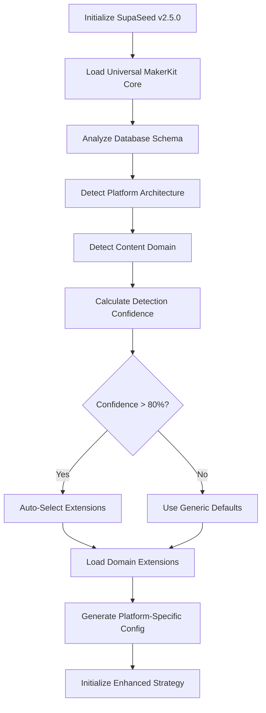
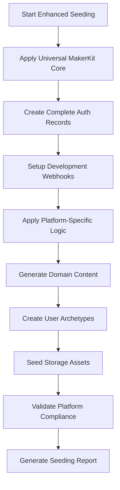
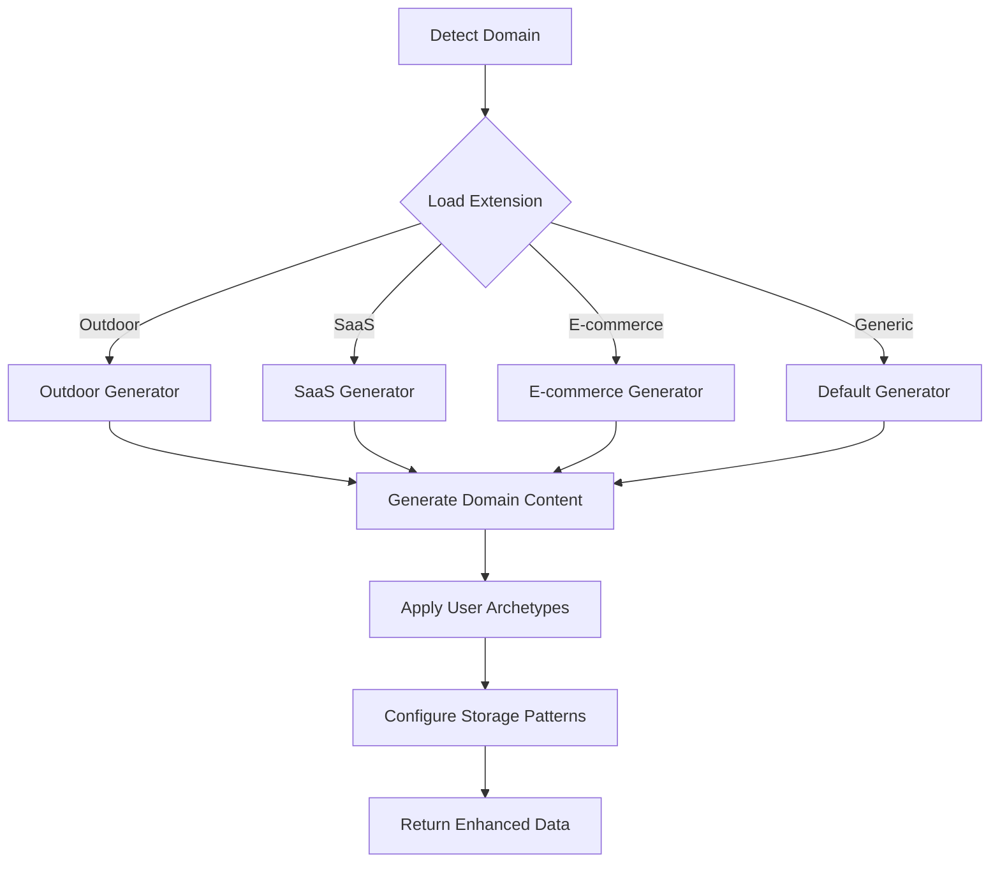

# Product Requirements Document (PRD)
## SupaSeed v2.5.0 - Universal MakerKit + Extensible Domain Architecture

### Executive Summary

Building on the successful v2.4.0 framework-aware architecture, SupaSeed v2.5.0 addresses critical gaps in MakerKit compatibility and introduces an extensible domain architecture. The current implementation provides basic MakerKit support but **lacks complete authentication flows, MFA support, and domain-specific extensibility** needed for production-ready seeding across diverse MakerKit platforms.

### Problem Statement

**Core Issues**: 
1. **Incomplete MakerKit Support**: Missing `auth.identities`, MFA factors, and development webhooks
2. **Limited Extensibility**: No support for domain-specific content (outdoor gear, SaaS tools, e-commerce)
3. **Platform Inflexibility**: Cannot adapt to different MakerKit architectures (individual vs team platforms)
4. **Compatibility Risk**: Wildernest-specific solutions could break compatibility with other MakerKit users

**Vision**: Transform SupaSeed into the definitive MakerKit seeding solution with universal core patterns + pluggable domain extensions.

---

## Feature Requirements Breakdown

### 1. Universal MakerKit Core System
**Epic**: Complete MakerKit Foundation
**Priority**: P0 (Critical)

#### Requirements:
- **FR-1.1**: Implement complete authentication flow (`auth.users` + `auth.identities`)
- **FR-1.2**: Add MFA factor seeding support for security testing
- **FR-1.3**: Support development environment webhook setup
- **FR-1.4**: Ensure 100% RLS policy compliance during seeding
- **FR-1.5**: Handle complex constraint relationships (e.g., `accounts_slug_null_if_personal_account_true`)

#### Acceptance Criteria:
- ✅ Creates both `auth.users` AND `auth.identities` records for complete auth flow
- ✅ Supports MFA factor creation for realistic security testing scenarios
- ✅ Sets up development-specific webhooks for feature functionality
- ✅ All seeded data passes RLS policies without bypass requirements
- ✅ Handles all MakerKit constraint patterns automatically

### 2. Smart Platform Detection Engine
**Epic**: Adaptive Architecture Intelligence
**Priority**: P0 (Critical)

#### Requirements:
- **FR-2.1**: Analyze schema to detect platform architecture (individual/team/hybrid)
- **FR-2.2**: Identify content domain via table pattern analysis (outdoor/SaaS/e-commerce/social)
- **FR-2.3**: Auto-select appropriate seeding strategies based on detection
- **FR-2.4**: Provide platform detection confidence scoring and reporting
- **FR-2.5**: Support manual platform/domain overrides in configuration

#### Acceptance Criteria:
- ✅ Automatically detects individual creator vs team collaboration platforms
- ✅ Identifies content domains with >90% accuracy via schema analysis
- ✅ Selects optimal user archetypes and content patterns automatically
- ✅ Provides detailed detection reports with confidence scores
- ✅ Allows manual overrides while maintaining detection intelligence

### 3. Pluggable Domain Extension System
**Epic**: Extensible Content Generation
**Priority**: P1 (High)

#### Requirements:
- **FR-3.1**: Implement plugin architecture for domain-specific content generators
- **FR-3.2**: Create outdoor gear domain extension (for Wildernest)
- **FR-3.3**: Support SaaS productivity domain extension (for team platforms)
- **FR-3.4**: Add e-commerce domain extension (for marketplace platforms)
- **FR-3.5**: Provide domain extension configuration and customization options

#### Acceptance Criteria:
- ✅ Plugin system supports multiple domain extensions simultaneously
- ✅ Outdoor extension generates realistic gear data with proper brands/pricing
- ✅ SaaS extension creates productivity-focused content and workflows
- ✅ E-commerce extension handles products, orders, and inventory patterns
- ✅ Extensions are configurable without breaking universal compatibility

### 4. User Archetype System
**Epic**: Platform-Appropriate User Generation
**Priority**: P1 (High)

#### Requirements:
- **FR-4.1**: Create platform-specific user archetype templates
- **FR-4.2**: Generate individual creator archetypes (for Wildernest-style platforms)
- **FR-4.3**: Generate team collaboration archetypes (for team platforms)
- **FR-4.4**: Support hybrid archetype patterns for mixed platforms
- **FR-4.5**: Customize archetype behavior and content patterns

#### Acceptance Criteria:
- ✅ Individual creator archetypes focus on content creation and sharing
- ✅ Team archetypes emphasize collaboration and workspace management
- ✅ Hybrid archetypes support both individual and team scenarios
- ✅ Archetype behavior matches platform purpose and user workflows
- ✅ Content generation reflects realistic usage patterns per archetype

### 5. Layered Configuration Architecture
**Epic**: Universal Compatibility + Customization
**Priority**: P1 (High)

#### Requirements:
- **FR-5.1**: Implement 3-layer configuration (Universal Core + Smart Detection + Extensions)
- **FR-5.2**: Provide minimal configuration with auto-detection defaults
- **FR-5.3**: Support extensive customization without breaking universal patterns
- **FR-5.4**: Create configuration templates for common platform types
- **FR-5.5**: Enable configuration inheritance and composition

#### Acceptance Criteria:
- ✅ Works out-of-the-box with zero configuration for any MakerKit app
- ✅ Smart detection provides appropriate defaults for detected platforms
- ✅ Extensive customization available without complexity for basic users
- ✅ Platform-specific templates accelerate setup for common scenarios
- ✅ Configuration layers compose cleanly without conflicts

### 6. Enhanced Storage Integration
**Epic**: Realistic Media and File Management
**Priority**: P2 (Medium)

#### Requirements:
- **FR-6.1**: Generate domain-appropriate images using external APIs
- **FR-6.2**: Support multiple storage patterns (media attachments, profile images, documents)
- **FR-6.3**: Implement storage bucket configuration per domain
- **FR-6.4**: Add file type and metadata generation appropriate to domain
- **FR-6.5**: Respect storage RLS policies and bucket permissions

#### Acceptance Criteria:
- ✅ Outdoor domain generates adventure/gear images from appropriate sources
- ✅ SaaS domain creates professional/productivity-focused media
- ✅ E-commerce domain produces product images and marketing assets
- ✅ Storage organization matches platform patterns and conventions
- ✅ All storage operations respect RLS and bucket security policies

### 7. Development Experience Enhancement
**Epic**: Developer Productivity and Debugging
**Priority**: P2 (Medium)

#### Requirements:
- **FR-7.1**: Add comprehensive CLI commands for platform detection and analysis
- **FR-7.2**: Provide detailed seeding reports with platform-specific insights
- **FR-7.3**: Create troubleshooting guides for common platform scenarios
- **FR-7.4**: Add performance benchmarking for different platform types
- **FR-7.5**: Support seeding dry-run mode with detailed analysis

#### Acceptance Criteria:
- ✅ CLI provides rich platform detection and analysis commands
- ✅ Seeding reports include platform-specific metrics and insights
- ✅ Troubleshooting documentation covers common platform patterns
- ✅ Performance benchmarks help optimize seeding for different scales
- ✅ Dry-run mode allows validation without actual data creation

---

## Design Specifications

### System Architecture

#### 1. Layered Configuration System
```typescript
interface SupaSeedConfig {
  // Layer 1: Universal Core (always active)
  universal: {
    makerkit: {
      completeAuthFlow: boolean; // auth.users + auth.identities + MFA
      constraintCompliance: boolean; // all MakerKit constraint patterns
      rlsCompliance: boolean; // 100% RLS policy respect
      developmentSupport: boolean; // webhooks, localStorage, etc.
    };
  };
  
  // Layer 2: Smart Detection (auto-configured)
  detection: {
    platform: {
      architecture: 'auto' | 'individual' | 'team' | 'hybrid';
      domain: 'auto' | 'outdoor' | 'saas' | 'ecommerce' | 'social' | 'generic';
      confidence: number; // detection confidence score
    };
  };
  
  // Layer 3: Extensions (pluggable)
  extensions: {
    domains: ('outdoor' | 'saas' | 'ecommerce' | 'social')[];
    archetypes: ArchetypeConfig[];
    customization: CustomizationConfig;
  };
}
```

#### 2. Platform Detection Engine
```typescript
class PlatformDetectionEngine {
  async detectArchitecture(schema: DatabaseSchema): Promise<ArchitectureDetection> {
    const indicators = {
      individual: this.analyzeIndividualPatterns(schema),
      team: this.analyzeTeamPatterns(schema),
      hybrid: this.analyzeHybridPatterns(schema)
    };
    
    return {
      type: this.selectHighestConfidence(indicators),
      confidence: Math.max(...Object.values(indicators)),
      details: indicators
    };
  }
  
  async detectDomain(schema: DatabaseSchema): Promise<DomainDetection> {
    const domainIndicators = {
      outdoor: this.checkOutdoorPatterns(schema), // setups, gear, trips, base_templates
      saas: this.checkSaaSPatterns(schema), // subscriptions, billing, features, usage
      ecommerce: this.checkEcommercePatterns(schema), // products, orders, inventory, cart
      social: this.checkSocialPatterns(schema) // posts, follows, likes, comments
    };
    
    return {
      primary: this.selectHighestConfidence(domainIndicators),
      confidence: Math.max(...Object.values(domainIndicators)),
      details: domainIndicators
    };
  }
}
```

#### 3. Domain Extension System
```typescript
abstract class DomainExtension {
  abstract name: string;
  abstract detectDomain(schema: DatabaseSchema): Promise<number>; // confidence score
  abstract generateContent(context: PlatformContext): Promise<DomainContent>;
  abstract getUserArchetypes(): UserArchetype[];
  abstract getStorageConfig(): StorageConfig;
}

class OutdoorDomainExtension extends DomainExtension {
  name = 'outdoor';
  
  async generateContent(context: PlatformContext): Promise<DomainContent> {
    return {
      gear: await this.generateRealisticGear(),
      setups: await this.generateGearSetups(),
      brands: this.getOutdoorBrands(),
      categories: this.getGearCategories(),
      images: await this.generateAdventureImages()
    };
  }
  
  getUserArchetypes(): UserArchetype[] {
    return [
      {
        email: 'creator@wildernest.test',
        role: 'user',
        purpose: 'Individual gear setup creator and sharer',
        contentPattern: { setups: 2, gearPerSetup: 5, publicRatio: 0.75 }
      },
      {
        email: 'explorer@wildernest.test', 
        role: 'user',
        purpose: 'Setup discoverer, reviewer, and community member',
        contentPattern: { browsesPublicSetups: true, leavesReviews: true }
      }
    ];
  }
}
```

#### 4. Universal MakerKit Core System
```typescript
class UniversalMakerKitCore {
  async createCompleteUser(userData: UserData): Promise<CompleteUser> {
    // Step 1: Create auth.users record
    const authUser = await this.createAuthUser(userData);
    
    // Step 2: Create auth.identities record
    const identity = await this.createAuthIdentity(authUser, userData.provider);
    
    // Step 3: Create MFA factors if enabled
    const mfaFactors = userData.mfaEnabled 
      ? await this.createMFAFactors(authUser)
      : [];
    
    // Step 4: Trigger MakerKit account creation (via kit.setup_new_user)
    const account = await this.triggerAccountCreation(authUser);
    
    // Step 5: Create profile and other related records
    const profile = await this.createUserProfile(authUser, account);
    
    return {
      authUser,
      identity,
      mfaFactors,
      account,
      profile
    };
  }
  
  async setupDevelopmentWebhooks(): Promise<WebhookConfig[]> {
    // Configure development-specific webhooks for feature functionality
    return [
      { event: 'auth.signup', endpoint: 'http://localhost:3000/webhooks/auth' },
      { event: 'db.account.create', endpoint: 'http://localhost:3000/webhooks/account' }
    ];
  }
}
```

#### 5. Smart Archetype System
```typescript
interface UserArchetype {
  email: string;
  role: string;
  purpose: string;
  contentPattern: ContentPattern;
  behaviorPattern: BehaviorPattern;
  platformContext: PlatformContext;
}

class ArchetypeManager {
  generateArchetypesForPlatform(
    platform: ArchitectureType, 
    domain: DomainType
  ): UserArchetype[] {
    const baseArchetypes = this.getBaseArchetypes();
    const platformModifications = this.getPlatformModifications(platform);
    const domainEnhancements = this.getDomainEnhancements(domain);
    
    return this.composeArchetypes(baseArchetypes, platformModifications, domainEnhancements);
  }
  
  private getBaseArchetypes(): UserArchetype[] {
    return [
      { email: 'admin@test.com', role: 'admin', purpose: 'Platform administration' },
      { email: 'user@test.com', role: 'user', purpose: 'Regular platform usage' }
    ];
  }
  
  private getPlatformModifications(platform: ArchitectureType): ArchetypeModification[] {
    switch (platform) {
      case 'individual':
        return [
          { focus: 'content_creation', collaboration: 'minimal' },
          { focus: 'discovery', sharing: 'public_focused' }
        ];
      case 'team':
        return [
          { focus: 'workspace_management', collaboration: 'high' },
          { focus: 'team_coordination', sharing: 'team_focused' }
        ];
      case 'hybrid':
        return [
          { focus: 'mixed_usage', collaboration: 'variable' }
        ];
    }
  }
  
  private getDomainEnhancements(domain: DomainType): ArchetypeEnhancement[] {
    const extensions = this.domainExtensions.get(domain);
    return extensions ? extensions.getArchetypeEnhancements() : [];
  }
}
```

### Data Flow Architecture

#### 1. Enhanced Framework Detection Flow


#### 2. Layered Seeding Flow


#### 3. Extension Plugin Flow


### Configuration Schema

#### 1. Minimal Configuration (Auto-Detection)
```json
{
  "makerkit": { "version": "auto-detect" }
}
```

#### 2. Platform-Specific Configuration (Wildernest Example)
```json
{
  "makerkit": { "version": "auto-detect" },
  "platform": { 
    "architecture": "individual", 
    "domain": "outdoor" 
  },
  "extensions": {
    "outdoor": {
      "enabled": true,
      "gearCategories": ["camping", "hiking", "climbing"],
      "brands": "realistic",
      "priceRange": "market-accurate"
    }
  },
  "archetypes": {
    "individual-creators": {
      "count": 4,
      "contentPatterns": {
        "setupsPerUser": 2,
        "gearPerSetup": 5,
        "publicRatio": 0.75
      }
    }
  }
}
```

#### 3. Team Platform Configuration (SaaS Example)
```json
{
  "makerkit": { "version": "auto-detect" },
  "platform": { 
    "architecture": "team", 
    "domain": "saas" 
  },
  "extensions": {
    "saas": {
      "enabled": true,
      "productivityFocus": true,
      "workspacePatterns": "team-collaboration"
    }
  },
  "archetypes": {
    "team-collaboration": {
      "teams": 2,
      "membersPerTeam": 3,
      "workspacePatterns": {
        "projectsPerTeam": 3,
        "tasksPerProject": 8
      }
    }
  }
}
```

### Success Metrics

#### Technical Metrics
- **Universal Compatibility**: 100% success rate with all MakerKit apps (zero configuration)
- **Detection Accuracy**: >90% platform architecture and domain detection accuracy
- **Extension Performance**: <10 seconds additional time per domain extension
- **Auth Completeness**: 100% complete auth flows (users + identities + MFA)
- **RLS Compliance**: 100% RLS policy compliance without bypass

#### Business Metrics
- **Market Coverage**: Support for 5+ MakerKit platform types (individual, team, hybrid)
- **Domain Coverage**: 4+ domain extensions (outdoor, SaaS, e-commerce, social)
- **Developer Experience**: <2 minutes from install to realistic test data
- **Compatibility**: 100% backward compatibility with existing v2.4.0 configurations
- **Community Adoption**: Framework-specific documentation and extension examples

### Implementation Priority

#### Phase 1: Universal MakerKit Core (P0 - Critical)
- Complete authentication flow implementation
- MFA factor support
- Development webhook setup
- Enhanced constraint handling
- RLS compliance validation

#### Phase 2: Smart Detection Engine (P0 - Critical)  
- Platform architecture detection
- Domain identification algorithms
- Auto-configuration based on detection
- Manual override support
- Detection confidence reporting

#### Phase 3: Extensible Architecture (P1 - High)
- Plugin system for domain extensions
- Outdoor domain extension (Wildernest)
- SaaS productivity extension
- User archetype system
- Layered configuration management

This PRD transforms SupaSeed into a universal, extensible MakerKit seeding platform that works perfectly out-of-the-box while providing deep customization for specialized platforms like Wildernest.